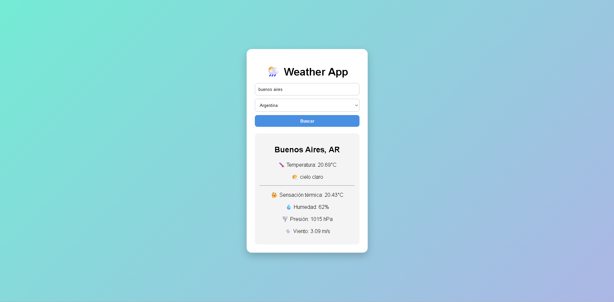

# 🌦️ Weather App

Aplicación del clima desarrollada con HTML, CSS y JavaScript vanilla, utilizando la API de OpenWeather para obtener datos meteorológicos en tiempo real.

---

## 🌐 Demo en vivo

👉 [Ver online](https://TU-LINK-AQUI.netlify.app)

---

## 📸 Vista previa

---

## ⚙️ Funcionalidades

- Buscar clima por ciudad
- Seleccionar país opcional
- Ver temperatura actual
- Ver sensación térmica
- Ver humedad
- Ver presión atmosférica
- Ver velocidad del viento
- Mostrar descripción del clima
- Manejo de errores (ciudad no encontrada / datos inválidos)

---

## 🧠 Tecnologías utilizadas

- HTML5
- CSS3
- JavaScript (Vanilla)
- OpenWeather API

---

## 📚 Aprendizajes

Este proyecto me permitió practicar:

- Consumo de APIs con fetch
- Manejo de async / await
- Manipulación del DOM
- Manejo de eventos
- Validación de inputs
- Lógica de manejo de errores